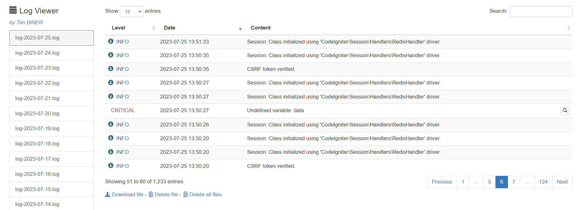

**CodeIgniter Log Viewer with Composer**

The `CodeIgniter Log Viewer` package is a convenient library for viewing and managing log files in a CodeIgniter 4 application. It allows users to display logs, download log files, and perform other log-related operations easily.

A typical log view looks like this:



## Requirements

- PHP 7.2 or later
- CodeIgniter 4

## Installation via Composer

You can install the `CodeIgniter Log Viewer` package using Composer, which is the recommended method for managing dependencies in CodeIgniter 4 applications.

1. Require the library via Composer by running the following command in your terminal:

   ```
   composer require vektormuhammadlutfi/codeigniter-log-viewer:^1.0
   ```

2. Once the package is installed, you can load the `CILogViewer` class in your controller or any other place where you want to use it:

   ```php
   use \VektorMuhammadLutfi\CodeIgniterLogViewer\CILogViewer;
   ```

3. Create a new instance of the `CILogViewer` class:

   ```php
   $logViewer = new CILogViewer();
   ```

4. Call the `showLogs` method to display the logs in the log viewer:

   ```php
   echo $logViewer->showLogs();
   ```

5. You can customize the behavior and appearance of the log viewer by modifying the configuration variables and view files as required.

## Usage

To use the `CodeIgniter Log Viewer` package in your CodeIgniter 4 application, follow these steps:

1. Make sure that the Composer autoloader is properly set up in your application. If you don't have an `index.php` file in your public directory, create one and add the following lines:

   ```php
   <?php

   require __DIR__.'/../vendor/autoload.php';

   // Rest of your CodeIgniter 4 bootstrap code...
   ```

2. Load the `CILogViewer` class in your controller or any other place where you want to use it:

   ```php
   use \VektorMuhammadLutfi\CodeIgniterLogViewer\CILogViewer;
   ```

3. Create a new instance of the `CILogViewer` class:

   ```php
   $logViewer = new CILogViewer();
   ```

4. Call the `showLogs` method to display the logs in the log viewer:

   ```php
   echo $logViewer->showLogs();
   ```

5. You can customize the behavior and appearance of the log viewer by modifying the configuration variables and view files as required.

## API Usage

The `CodeIgniter Log Viewer` package also provides an API that allows you to programmatically access log files and perform operations.

1. To retrieve a list of log files, send a GET request to `/logs?api=list`.

2. To view the logs of a specific file, send a GET request to `/logs?api=view&f=<file_name>`, where `<file_name>` is the base64-encoded name of the log file.

3. To delete a log file, send a GET request to `/logs?api=delete&f=<file_name>`, where `<file_name>` is the base64-encoded name of the log file you want to delete. You can also use `&f=all` to delete all log files.

4. Make sure to handle the JSON response from the API and display it appropriately in your application.

## Contributing

Contributions to this project are highly welcomed! If you encounter any issues or have suggestions for improvements, please feel free to open an issue or submit a pull request.

## License

This project is licensed under the [MIT license](https://opensource.org/licenses/MIT).

## Credits

- The `CodeIgniter Log Viewer` package is a refactor of the original library by Miguel Martinez. It is further developed and maintained by Muhammad Lutfi.

## Resources

- [CodeIgniter 4 User Guide](https://codeigniter.com/user_guide/index.html)

---

We hope you find the `CodeIgniter Log Viewer` package helpful for accessing and managing log files in your CodeIgniter 4 application. If you have any questions or need further assistance, please don't hesitate to reach out!
